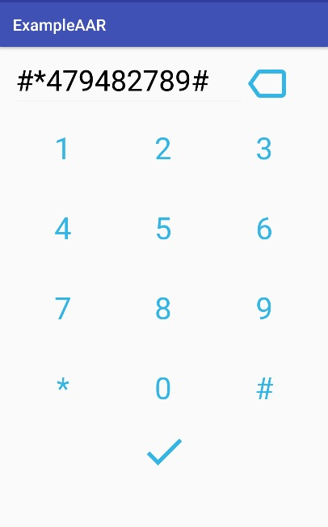
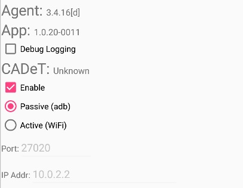
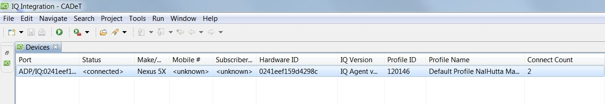
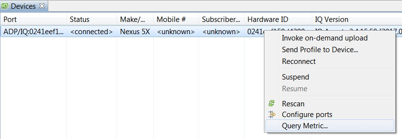

InsightsAAR integration
-------------
###Summary
In order to provide third-party developers & customers with a version of the Agent/PL that can be seamlessly integrated with their app, the PL and Agent binaries are now bundled and released as an AAR (Android Archive) library  

### AAR Structure
The AAR library includes
>- The Java portion of the PL (compiled code) 
>- The native implementation of the PL (compiled code)
>- The IQAgent binaries
The necessary AIDL files that define the API provided by the IQIService as well as the Parcelable classes that can be shared via IPC
>- The default profile

Read below article first to know about AAR(Android ARchive).
https://developer.android.com/studio/projects/android-library.html

-------------
###Change build.gradle
InsightsAAR is uploaded on Nexus repository. you need to change your app's build.grade to be compiled with InsightsAAR.

####Add NEXUS repository
```
repositories {
    maven {
        credentials {
            username System.getenv('NEXUS_USER')
            password System.getenv('NEXUS_PASSWORD')
        }
        url "https://nexus.carrieriq.com/content/repositories/releases"
    }
}
```
####Add compile dependency
```
dependencies {
    compile 'com.carrieriq:insightsAAR:3.4.16.126.60-RELEASE.60:AAR-debug@aar'
}
```
-------------
###Start/Stop IQIService in your app
IQIService is supposed to be run as a remote service and bound. See more details about AIDL in below article.
https://developer.android.com/guide/components/aidl.html
You can also refer to the source codes in  /Example1

####Service callback function
```
/**
 * Class for interacting with the main interface of the service.
*/
private ServiceConnection mConnection = new ServiceConnection() {
    public void onServiceConnected(ComponentName className, IBinder service) {
        mService = IIQIService.Stub.asInterface(service);
        mSettingButton.setEnabled(true);
        mUnBindButton.setEnabled(true);

        Toast.makeText(TestListActivity.this, R.string.IQIService_connected,
                Toast.LENGTH_SHORT).show();
    }

    public void onServiceDisconnected(ComponentName className) {
        mService = null;
    }
};
```

####Start service
```
bindService(new Intent(getApplicationContext(), 
        com.att.iqi.apl.service.IQService.class),
        mConnection, Context.BIND_AUTO_CREATE);
```
In debug build only, you can see IQIService initialization in ADB logs.
```
IQAgent IQServer.cpp(126): IQAgentServerInitProc(): iqi.diagnostic
IQAgent IQServer.cpp(140): calling IQBackend_Initialize(): iqi.diagnostic
IQAgent IQServer.cpp(143): calling IQAgentInitServerClients(): iqi.diagnostic
IQAgent IQServer.cpp(184): IQAgentServerProc (2317): iqi.diagnostic
```

####Stop service
```
unbindService(mConnection);
mConnection = null;
```
In debug build only, you can see IQIService termination in ADB logs.
```
IQAgent IQServer.cpp(245): calling IQBackend_Shutdown(): iqi.diagnostic
IQAgent IQServer.cpp(253): IQAgentServerProc() finished: iqi.diagnostic
```

-------------
### Test with CADeT
####Launch UI setting
To launch settings UI, `openSettings()` needs to be called after service is bound.
```
mService.openSettings();
```
You can see dial keypad.

####Connect CADeT
Unlock device with key codes  `#*479482789#` + <i class="icon-check"></i>, 
Then launch settings UI `#*47234#` + <i class="icon-check"></i>

 Check CADeT connectivity <i class="icon-check"></i> and do  `#*47100#` + <i class="icon-check"></i> 


If the CADeT is connected well, agent version and profile id will show up. 


Right click on device field and Query metric to see queriable metrics

